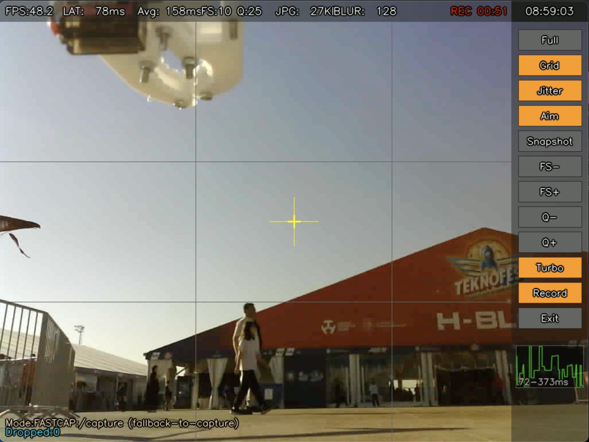

# ESP32-CAM Python GCS (Ground Control Station)


A lightweight, single-file desktop GUI designed for **ESP32-CAM** modules. Built with Python and Tkinter, it provides a stable interface for streaming, recording, and controlling your ESP32 camera.

It is designed to work seamlessly with the standard Arduino "CameraWebServer" example firmware.

## 🚀 Features

* **Live Streaming (MJPEG):** Robust streaming using OpenCV with automatic reconnection logic.
* **Video Recording & Snapshots:** Capture snapshots (JPG) and record video (MP4) directly to your PC with a single click.
* **Remote Control:** Adjust camera **Resolution** and **Quality** settings remotely via the GUI without resetting the board.
* **Safe Mode:** A fallback mode that uses HTTP `/capture` requests (2-3 FPS) for situations where the stream is unstable.
* **OSD & Telemetry:** On-Screen Display showing real-time FPS and connection status.
* **Zero-Setup:** Runs as a single `.py` file without complex installation.

## 🛠️ Prerequisites

You need **Python 3.x** installed on your system.
The following Python libraries are required:

* `opencv-python`
* `numpy`
* `requests`
* `Pillow` (PIL)
* `tk` (Usually included with Python)

## 📦 Installation

1.  **Clone the repository:**
    ```bash
    git clone https://github.com/YakupTekeli/Ground-Control-Station-for-ESP32-and-ESP32-Camera.git
cd Ground-Control-Station-for-ESP32-and-ESP32-Camera
    ```

2.  **Install dependencies:**
    ```bash
    pip install -r requirements.txt
    ```
    *(If you don't have a requirements file, use: `pip install opencv-python numpy requests Pillow`)*

## ⚙️ Configuration

By default, the script is configured for the ESP32 **Access Point (AP)** default IP: `192.168.4.1`.

If your ESP32 is connected to your home Wi-Fi (Station Mode), you must edit `main.py`:

1.  Open `main.py` in a text editor.
2.  Locate the **USER SETTINGS** section at the top.
3.  Update the IP address to match your ESP32:

```python
# ---------- USER SETTINGS ----------
BASE_HOST  = "[http://192.168.1.](http://192.168.1.)XX"            # Your ESP32 IP Address
STREAM_URL = "[http://192.168.1.](http://192.168.1.)XX:81/stream"  # Stream Port (Usually 81)
````

## ▶️ Usage

1.  Power on your ESP32-CAM.
2.  Connect your PC to the ESP32's Wi-Fi (if using AP mode) or ensure both are on the same network.
3.  Run the application:
    ```bash
    python main.py
    ```
4.  Click **Start** to begin the stream.

## 📂 Outputs

All recorded videos and snapshots are automatically saved in the `gcs_output` folder created within the project directory.

## 🤝 Compatibility

This tool works best with the standard **CameraWebServer** example found in the Arduino IDE:

  * `File` -\> `Examples` -\> `ESP32` -\> `Camera` -\> `CameraWebServer`

-----

